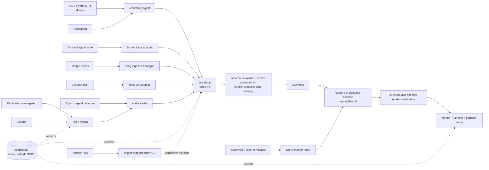

# Media Studio — engineering audit and onboarding guide

> ## ⚠️ FROZEN SNAPSHOT — not a live document
>
> Taken at commit `fbeaf06`, 2026-08-03. **It is not maintained and will drift.**
> It ranks 4th in AGENTS.md §Which document wins; `AGENTS.md` and `STATUS.md`
> outrank it, and observed behaviour outranks all three.
>
> **Read it for one thing: the 13 findings.** Those are reproduced defects, not
> opinions, and they are the repo's real work queue. Everything above §Findings
> duplicates AGENTS.md and STATUS.md — prefer those, they are kept current.
>
> Status of the findings is tracked in STATUS.md, not here. **P0.7 is partly
> closed** as of `a78f9be` — there is now one test command (`make check`), pure
> and Resolve-driving suites are split, and a pre-commit gate runs it.
> Still open within P0.7: incomplete `requirements.txt`, no `doctor` command,
> no CI, and fixtures that reference gitignored media.

*Snapshot: 2026-08-03, repository commit `fbeaf06`, branch `master`.*

This document is a current-state engineering handoff for a new contributor. It
describes what the system actually does, how its parts fit together, what is
working, what is unsafe or incomplete, and the recommended work order. It is an
audit, not a replacement for the operating rules in [AGENTS.md](../AGENTS.md)
or the live chronological record in [STATUS.md](../STATUS.md).

## Contents

- [Executive conclusion](#executive-conclusion)
- [Purpose, goals, and truth hierarchy](#what-the-project-is)
- [System map and central contracts](#system-map)
- [Components and workflows](#repository-map-and-moving-components)
- [Cross-repository and runtime boundaries](#cross-repository-and-external-boundaries)
- [Verified health snapshot](#audit-health-snapshot)
- [Findings and risks](#findings-and-risks)
- [Recommended roadmap](#recommended-roadmap)
- [Starter tasks and onboarding path](#recommended-first-tasks-for-the-new-engineer)
- [Safety checklist and glossary](#non-negotiable-safety-checklist)

## Executive conclusion

Media Studio is a working, repeatedly exercised local production instrument,
not a paper architecture. Its core loop—media ingest, Story IR construction,
OTIO compilation, Resolve import, structural verification, and conversational
IR mutation—has real tests and real-machine proof behind it. The audit ran 138
safe/local assertions successfully: all 15 current workspace IRs passed JSON
Schema validation and 14 passed semantic lint. The registry, templates,
Blender adapter, auto-editor adapter, git repository, and installed Python
environment passed their structural checks. SQLite integrity is healthy, but
registry completeness and recoverable-history gaps are substantial.

It is not yet safe to treat as durable production infrastructure without an
experienced operator. The most important problems are not missing creative
features. They are protection of the edit source of truth, central validation,
wrong-media prevention, Resolve readiness/concurrency enforcement, delivery
provenance after the human GUI pass, and reproducible cold-start setup.

The right near-term direction is therefore:

1. protect and version current edit state;
2. make every write pass one shared validation transaction;
3. enforce the Resolve rules in code rather than memory;
4. make verification prove media identity and final-output contracts;
5. make a clean checkout reproducible;
6. then complete the cross-repository trigger-map-to-video path.

The project should not begin another broad feature phase before those rails are
in place.

## What the project is

Media Studio is the agentic instrument layer between Ryan and DaVinci Resolve
Studio. It turns precise, conversational edit decisions into editable Resolve
timelines while leaving authorship and final taste with Ryan.

The operating model is deliberately **copilot, not autopilot**:

- Ryan owns the footage, script, creative cut, visual taste, prompt direction,
  template/grade approval, and final hands-on Resolve pass.
- The agent owns mechanical precision: ingest, transcription, timestamp
  mapping, Story IR mutation, compilation, template population, rendering,
  delivery, and verification.
- Resolve is the editor and review surface. The project does not build a rival
  NLE or bespoke editing GUI.
- The intended invariant is that every machine-authored edit is expressed in
  Story IR and compiled to a fresh content-addressed Resolve project/timeline.
  Native captions currently violate it by mutating a cached timeline outside
  IR, hashing, and verification; beat/SRT sidecars also need explicit lineage.
- After Ryan begins the final GUI pass, machine edit scripts must not mutate
  that timeline.

### Goals

- Make scene-by-scene editing conversational and fast.
- Preserve deterministic, inspectable edit decisions outside Resolve.
- Work around Resolve's append-only scripting surface with OTIO compilation.
- Fail closed before touching Resolve or spending hosted-generation money.
- Verify artifacts against observed media/timeline state rather than API return
  values.
- Keep the AI harness replaceable: load-bearing behavior lives in files and
  command-line verbs in the repository.
- Reuse the owned studio toolchain—Resolve Studio, OBS, Blender, Stream Deck,
  and Rogue Amoeba products—before inventing replacement infrastructure.

### Explicit non-goals

- One-shot brief-to-finished-video generation.
- Reconstructing Ryan's GUI edits back into Story IR.
- Authoring color grades by script; Ryan authors, the agent eventually applies.
- A custom visual editing surface.
- Absorbing the music, clip-capture, bongpot, or cutwork repositories.
- Restarting Resolve with `pkill`, moving source recordings out of `Movies`, or
  bypassing approval gates for paid generation.

## How to determine what is true

The repository contains design proposals, chronological logs, and current code.
They do not all describe the same moment in time. Use this precedence:

1. **Observed behavior, artifacts, code, and tests** decide what the software
   currently does.
2. **[AGENTS.md](../AGENTS.md)** decides operating doctrine and safety rules.
3. **The top of [STATUS.md](../STATUS.md)** decides the current session pickup
   point and the latest historical corrections.
4. **This audit** is the current architecture and risk synthesis at `fbeaf06`.
5. **[docs/PLAN.md](PLAN.md)** is the phase map and decision history; many
   later sections are chronological snapshots.
6. **[ARCHITECTURE.md](../ARCHITECTURE.md)** is a 2026-07-11 proposal, not the
   current implementation map.
7. **[RESEARCH.md](../RESEARCH.md)** and the Lane B reports are research inputs,
   not runtime truth. Preserve their confidence labels.

When code and a status document disagree, verify the behavior, fix the code or
document, and record the correction. Do not average conflicting claims.

## System map



## The central contracts

### Story IR

The current schema is
[schema/story-ir.schema.json](../schema/story-ir.schema.json). It accepts the
version labels `0.1`, `0.2`, and `0.3`; the implementation currently uses one
additive schema rather than three discriminated version contracts.

Important semantics:

- Timing is expressed as integer frames under one rational timeline timebase.
- `srcIn` is inclusive and `srcOut` is exclusive.
- Assets are video, audio, or image files.
- Edits carry asset, source range, record frame, track, and optional evidence.
- Markers and graphics are separate top-level entities.
- Captions and beat details are sidecar artifacts, not first-class IR entities.
- The current `story.json` is the machine-edit source of truth.

[studio/ir.py](../studio/ir.py) hashes canonical IR JSON plus
`COMPILER_EPOCH = 2`. The resulting Resolve project and timeline are both named
`{name}@{hash8}`. A changed IR creates a different Resolve project. Contrary to
some conversational wording in the docs, revisions are not timelines inside
one shared project.

### Workspace

A normal workspace is `outputs/projects/<name>/` and may contain:

```text
story.json             current mutable Story IR
story.otio             latest emitted interchange file
transcript.json        Deepgram words and utterances
beats.json             complete beat grid
captions.srt           cut-remapped caption sidecar
media/                 intake copies and safe-path media
graphics-cache/        baked ProRes 4444 alpha masters
forge/                 generated stills, motion, Blender output, provenance
render/                 verification renders
delivery/               Resolve master and ffmpeg derivatives
```

Recordings normally remain in `/Users/SSDrive/Movies` and are referenced in
place. Do not move or clean that folder casually.

### Timeline and audio layout

- V1 is the primary picture spine.
- V2 and above hold silent cutaways/b-roll.
- V1 media with audio is mirrored frame-exactly onto A1.
- In talking-head work, A1 is the voice and is sacred.
- In song workspaces, the whole uncut song owns A1.
- Music, SFX, and stems belong on A2 and above.
- Graphics occupy one video track above all edit tracks.

Graphics do not travel through OTIO. The compiler populates a Fusion template
on a scratch Resolve timeline, renders a ProRes 4444+alpha master, and appends
that baked file to the target timeline. The target object is therefore not an
Inspector-editable Fusion title, despite older architecture text saying it is.

### Human finishing boundary

The intended sequence is machine assembly first, Ryan's GUI pass last. Nothing
currently records that a timeline has become human-touched, and Story IR cannot
represent the resulting changes. This is a real boundary, not just a product
principle; it creates delivery and caching issues documented below.

## Repository map and moving components

| Area | Primary files | What it does | Current status |
|---|---|---|---|
| Operating doctrine | `AGENTS.md`, `CLAUDE.md` | Safety, workflow, trust boundaries, collaboration rules | Active, but some CLI details have drifted |
| Live history | `STATUS.md`, `docs/PLAN.md` | Session record, phase status, open gates | Rich but chronological and internally stale in places |
| IR contract | `schema/story-ir.schema.json`, `studio/ir.py` | Schema, timebase, extent, hash, timeline identity | Core and working; validation/version gaps remain |
| Media gates | `studio/lint.py`, `probe.py`, `intake.py` | ffprobe, bounds, path safety, overlaps, hashes, intake | Working; contains a wrong-media collision bug |
| OTIO | `studio/emit.py` | IR to deterministic video/audio tracks and gaps | Working and well tested |
| Resolve adapter | `studio/resolve.py`, `compile.py` | Connect, create project, stamp fps/resolution, import, markers, graphics | Live-proven; modal/global-lock rules unenforced |
| Verification | `studio/verify.py` | Timeline geometry and optional render/audio checks | Useful but proves geometry more than identity |
| Recording ingest | `tools/ingest-recording.py`, `studio/ingest.py`, `silence.py`, `transcribe.py` | Probe, auto-editor spans, Deepgram, evidence-linked IR, compile | Live-proven; persistence occurs before lint |
| Assembly loop | `tools/edit-ir.py`, `studio/edit_ir.py`, `moments.py` | Find phrases; insert/remove/retime images, clips, graphics, music, stems | 50 local assertions pass; final-edit edge case is broken |
| Registry | `studio/registry.py`, `registry.db` | Local index of assets, transcripts, IR metadata, renders, templates, decisions | SQLite healthy; incomplete hashes/history/coverage |
| Templates | `templates/*`, `studio/templates.py`, `tools/preview-template.py` | Approval manifests, Fusion lint/install, alpha-master forge/place | 13 production entries approved; 9 remain provisional aesthetically |
| Captions | `studio/captions.py`, `tools/make-captions.py` | Deepgram to cut-remapped SRT; optional native subtitles | SRT path works; native path not live-exercised and is outside IR |
| ScreenSage | `tools/ingest-screensage.py` | Voice selection, display/voice mux, VFR normalization, camera registration, event markers | Proven on a real bundle; camera is registered, not actually placed |
| OBS/daemon | `studio/obs.py`, `studio/daemon.py` | OBS websocket control, loopback HTTP verbs, serialized background jobs | Daemon is live; its state/log lifecycle is weak |
| Delivery | `tools/deliver.py`, `studio/delivery.py` | One Resolve master, vertical MP4, loud-normalized podcast M4A | Historically live-proven; final-pass cache and verification gaps |
| Scene Forge | `studio/forge.py`, `tools/forge-*.py` | Spend-gated stills/I2V, contact sheets, Blender output | Mechanically proven; hosted generation is currently parked |
| Blender | `studio/blender.py`, `blender/orbit-cube.py` | Headless PNG sequence and H.264 mux | One fixture scene, not a general library; planning gated |
| Song lane | `tools/ingest-song.py`, `studio/beatgrid.py`, `tools/beat-grid.py` | Song A1, stems A2+, declared/estimated beat markers | Built and live-proven |
| Ableton G2 | `studio/ableton.py`, `tools/als-trigger-map.py` | Read-only `.als` parse to one entry per sample firing | 38 assertions pass; downstream consumer absent |
| Bongpot adapter | `studio/bongpot.py`, `tools/ingest-bongpot.py` | One-way plan/clip/audio conform into a finishing timeline | Built; integration hard-stops here by decision |
| Resolve MCP | `.mcp.json`, ignored `vendor/davinci-resolve-mcp` | Exploratory conversational Resolve surface | Installed on this machine; not reproducible from checkout |

At audited commit `fbeaf06`, the repository contained 112 tracked files and
roughly 6,900 lines of Python across production modules, tools, tests, and
smoke scripts. The design is a set of small command-line verbs over a
comparatively compact `studio/` library, which is a good fit for its
agent-operated use.

## Primary workflows

### 1. Talking-head or screen recording

```text
OBS Hybrid MP4 in Movies
  -> resolve-safe path
  -> ffprobe
  -> auto-editor v3 loud spans
  -> Deepgram nova-3 words/utterances (optional graceful degradation)
  -> evidence-linked Story IR + transcript markers
  -> lint
  -> OTIO
  -> Resolve project/timeline
  -> structural verification
  -> optional render verification
```

The recording is not moved. Files over 50 MB are reduced to an audio sidecar
before Deepgram upload; smaller media is uploaded as the original file. The
statement “dragging into chat uploads nothing” applies to intake, not to the
later transcription network call. The current implementation writes/registers
the generated IR before its semantic-lint step; P0.2 corrects that unsafe
ordering and adds the missing producer-side schema gate.

### 2. Conversational assembly

`edit-ir.py find` matches normalized transcript words and converts source time
through kept silence spans to a cut-timeline frame. Mutation verbs operate on a
copy of the IR, lint it, rewrite `story.json`, compile a new hash, verify the
timeline, and switch Resolve to it.

The meme house default is full-frame V2, 3.5 seconds, with V1/A1 voice under it.

### 3. Templates and captions

Only manifest-approved Fusion templates pass graphics lint. Previewing and
approval are separate: a preview never flips approval automatically. All 13
production entries are manifest-approved and executable. Four news-desk
entries received full eye approval; the other nine were accepted as working
infrastructure but remain aesthetically provisional.

Captions default to an SRT sidecar whose source timestamps are remapped through
the kept-span edit. They are not automatically part of a compiled timeline.

### 4. Song and sample-synced video

The song front door keeps the full track on A1, puts stems on consecutive A2+
lanes, and writes an exact beat grid when BPM is declared. The Ableton G2 parser
now emits where each sample fires in the arrangement. The missing piece is the
consumer that joins each trigger through the music/clip ledgers and inserts the
matching source video range into Story IR.

### 5. Delivery

Delivery compiles or reuses the IR timeline, renders one Resolve H.264 master,
and derives vertical video and podcast audio with ffmpeg. The current vertical
default is an honest center crop; creative reframing remains a human pass.

### 6. Generated and deterministic media

Replicate still and I2V commands print a price and exit with code 2 without
spending unless `--approve` is supplied. An agent may supply that flag only
after Ryan approves that exact printed batch/clip cost in conversation.

Blender is local and free, but currently consists of one orbit-cube fixture.
The default 24 fps conflicts with a known 24-to-60 fps conform problem; render
at the target timeline fps until the root cause is fixed.

## Cross-repository and external boundaries

### Sibling repositories

| Repository | Owns | Boundary/status at audit |
|---|---|---|
| `media-studio` | Video finishing, Story IR, OTIO, Resolve, delivery | Clean and synchronized with private `origin/master` before this audit document |
| `~/projects/obs-control-room` | Stream Deck Control Room surface | Clean local `master`, but **has no remote**; immediate backup risk |
| `~/projects/rectum` | Monitor capture, clip library, crop proposal | Clean and synchronized; crop still needs a real-reel verdict |
| `~/projects/blessdog` | Music, SP-404 sample library | Clean `feat/sound-control`; joins by files/content hashes, never imports this repo |
| `~/projects/bongpot` | Its own film pipeline | Read-only one-way adapter here; no writes back and no project restart |
| `~/projects/cutwork` | Its own HyperFrames doctrine | Does not route through Resolve unless Ryan changes that boundary there |

The intended sample-video join is:

```text
Ableton firing sample hash
  -> SP-404 ledger entry
  -> source_clip_hash + source_in_secs
  -> rectum/media asset
  -> Story IR video cutaway at track_start_secs
```

That contract is not yet valid end to end. `studio/ableton.py` hashes the sample
file referenced by the `.als`. `phase8_sp404` records the hash of its
pre-conversion source but does not record the hash of the converted staged WAV.
On the live ten-entry SP ledger, none of the staged WAV hashes matches the
stored `source_hash`. If Ableton references the staged SP-ready WAV, G2 cannot
find its ledger entry. Fix the identity contract before building Pipeline H.

### Runtime dependencies

| Dependency | Role | Audit state |
|---|---|---|
| Apple Silicon host (M1 Pro, 16 GB) | Single-studio workstation | Current machine; older docs that say M1 Max are stale |
| macOS 26.5.2 | Single-studio host | Installed |
| DaVinci Resolve Studio 21.0.2 / build 21.0.20004 | NLE and render engine | Installed; Full Disk Access `auth_value=2`; offline during audit |
| OBS 32.2.1 | Capture | Installed; offline during audit |
| Stream Deck 7.4.2 | Physical control surface | Installed; current plugin lives in sibling repo |
| Blender 5.1.2 | Deterministic local imagery | Installed; headless probe passed |
| Python 3.12.2 | CLI/runtime | Repository venv healthy |
| FFmpeg/ffprobe 8.1.2 | Probe, conform, mux, loudness, derivatives | Installed |
| auto-editor 29.3.1 | Silence span analysis | User install; synthetic probe passed |
| Deepgram nova-3 | Transcription/diarization | Network/key required; not called by this audit |
| Replicate | Hosted still/I2V generation | Token/spend approval required; not called by this audit |
| Rogue Amoeba suite | Audio capture/routing/playback | Owned studio layer; most integration is outside this repo |
| ScreenSage | Optional multitrack source bundle | Adapter exists; external app not owned here |

`requirements.txt` is not a complete environment manifest. Runtime code also
needs `requests`, Pillow, and librosa; tests directly need NumPy and soundfile.
FFmpeg, auto-editor, Blender, Resolve, and the MCP checkout need explicit setup
or doctor checks.

## Audit health snapshot

### Safe/local tests

| Suite | Result |
|---|---:|
| `tests/test_registry.py` | 8/8 |
| `tests/test_assembly.py` | 50/50 |
| `tests/test_bongpot.py` | 16/16 |
| `tests/test_forge.py` | 17/17 |
| `tests/test_forge4.py` | 9/9 |
| `tests/test_ableton.py` | 38/38, including the two local real `.als` fixtures |
| **Total** | **138/138** |

Additional checks completed successfully:

- 57 Python files parsed and all 24 `studio` modules imported.
- All 14 tool CLIs returned successful `--help`.
- `pip check` reported no broken installed packages.
- SQLite `PRAGMA integrity_check` returned `ok`.
- All 15 current workspace `story.json` files pass JSON Schema validation.
- Fourteen current workspaces pass semantic lint; historical
  `daemon-smoke/story.json` is red because it references a spaced OBS path.
- All template manifest entries pass structural setting lint; 14 are approved
  including the smoke fixture, and one smoke entry is intentionally unapproved.
- A four-frame 320x180 headless Blender render passed.
- A synthetic auto-editor run produced a valid `30/1` span map.
- The Forge no-approval gate exited 2 and created no spend or workspace.
- `git fsck`, `git diff --check`, and tracked-tree/history secret scans passed.
- The pushed tree contains neither `.env` nor `registry.db`; local and remote
  were 0 commits apart before the audit document was added.

### Checks deliberately not run

Resolve and OBS were offline. The audit therefore did not run
`tests/test_compile.py`, Resolve smoke scripts, live rendering/delivery, native
captions, OBS websocket mutations, Deepgram, or Replicate. Those operations
either mutate external applications, require a live single-client Resolve
session, make network calls, or can spend money.

Historical repository evidence records `test_compile.py` at 7/7 without render
and 9/9 with render after closing Resolve modals. That is useful evidence, but
it is not a current audit rerun.

### Live local state

- The studio daemon is listening on `127.0.0.1:8873` with no running jobs.
- Its status correctly reports OBS and Resolve unreachable while they are down.
- It still discovers the newest recording in `Movies`.
- The local registry contains 53 assets, 15 transcripts, 33 IR rows, 8 renders,
  11 decisions, and 13 template rows.
- Eleven indexed asset paths are currently missing; only one of 53 assets has a
  SHA-256.
- Thirty-three IR hashes point to only sixteen paths; many historical rows now
  point to a newer overwritten `story.json`.

## What is working particularly well

- The IR/OTIO boundary is the correct response to Resolve's append-only API.
- Frame-integer, exclusive-end timing avoids cumulative drift.
- `COMPILER_EPOCH` gives compiler semantic changes an explicit cache breaker.
- Absolute-path, no-space, project-fps, fresh-project reload, graceful restart,
  and audio-verification rules encode real failures learned on this machine.
- Edit transformations are mostly pure functions and have meaningful local
  coverage.
- The audio spine explicitly protects voice and keeps cutaways silent.
- The linter probes real media instead of trusting IR claims.
- The verifier has already caught a historically silent mute-timeline defect.
- The Ableton parser is unusually defensive: it rejects tempo automation and
  tests GroovePool, loops, loop braces, stale absolute paths, file sizes, and
  real projects.
- Spend gates and Ryan's-eyes gates correctly protect money and aesthetics.
- The daemon shells the same CLIs used by agents instead of duplicating logic.
- Cross-repository integrations are file/hash based and one-way, preserving
  ownership boundaries.
- The git remote is private, synchronized, and clean of local secrets/state.

## Findings and risks

Priority meanings:

- **P0** — fix before trusting additional live editing or delivery work.
- **P1** — fix before completing the next integrated workflow.
- **P2** — valuable hardening or explicitly gated future work.

### P0 — correctness, source-of-truth, and operator safety

#### P0.1 `resolve_safe()` can silently select the wrong media

[studio/intake.py](../studio/intake.py) normalizes a spaced filename to an
underscore name. If that destination already exists, it returns it without
checking that its content matches the source. The audit reproduced a new spaced
source resolving to an older, different underscore file.

Impact: the wrong footage can enter an edit while all later path, duration, and
geometry checks look plausible.

Required fix: compare content before reuse; choose a deterministic hash-suffixed
name for collisions; record and verify the resulting hash. Add a regression
test with two different files whose names normalize identically.

#### P0.2 Generated/mutated IR is not centrally schema-validated

`studio.ir.load()` validates loaded JSON, but most producers build dictionaries
and call `studio.lint.lint()` directly. Semantic lint does not invoke JSON
Schema. Several ingest tools write/register the IR before linting it.

Confirmed failures:

- invalid names such as `"X bad"` or one-character `"x"` produce no semantic
  errors;
- `30/0` matches the schema's string pattern and later raises division by zero;
- an IR whose `assets` and `edits` arrays are both empty returns semantic-lint
  green;
- removing the final edit can overwrite `story.json` with an invalid empty IR,
  then crash when registry extent calculation calls `max()`.

Required fix: one shared transaction for every front door and mutation:

```text
schema validation
  -> semantic/media lint
  -> atomic immutable snapshot + current-pointer update
  -> registry transaction
  -> compile
  -> verification
```

No failure before the current-pointer update may alter the existing valid IR.

#### P0.3 The edit source of truth is mutable and locally unbacked

`outputs/` and `registry.db` are intentionally gitignored, but no replacement
backup policy exists. Each mutation overwrites the same `story.json`. Registry
IR history retains hashes and the same mutable path, not the JSON body.

The live DB demonstrates the problem: 33 IR rows, 16 distinct paths, and
multiple historical hashes per overwritten file. Resolve may retain old local
projects, but the machine edit decisions cannot be reconstructed. The ignored
local `outputs/` tree is already roughly 1.4 GB, so this is current production
state at risk rather than a hypothetical future concern.

Required fix:

- choose a private backup target and snapshot the current `outputs/` tree and
  registry before restructuring them;
- write `history/story@<hash>.json` immutably before updating `story.json`;
- store the IR body or immutable snapshot path in the registry;
- define private backup/export/restore for workspaces, registry, generated
  assets, and source-recording references;
- test restore on a temporary root.

Git should continue excluding large/private media; the answer is a real state
backup, not committing `outputs/` blindly.

#### P0.4 Resolve readiness and single-client rules are not enforced

The manual's newest hard rule says `app.GetCurrentPage()` must be non-`None`
before trusting any scripting result. No production code calls it. The daemon
has an in-process lock, but direct CLIs, other agents, and the MCP server do not
share it.

Impact: the exact modal-dialog failure and concurrent-client wedge that already
cost hours remain possible.

Required fix:

- central `resolve_preflight()` that rejects a modal, unavailable API, wrong
  scripting mode, or missing project manager;
- one interprocess lock shared by every Resolve-touching CLI and daemon job;
- explicit MCP coexistence policy, preferably through the same broker/lock;
- readiness status surfaced by a `doctor` command and daemon `/status`.

#### P0.5 Verification can pass the wrong timeline or output

Timeline verification checks counts, record frames, durations, and fps. It does
not prove clip/media identity, source in/out, markers, resolution without
render, graphic content/alpha, or audio-source identity. Lint also fails to
model V1's emitted A1 mirror, so `add-music --track 1` can overlap sacred voice
and lint green.

Delivery checks are weaker: they do not compare expected IR duration or output
dimensions, and a missing `volumedetect` match—including `-inf`—does not fail.
Podcast loudness is transformed but not verified as LUFS.

Required fix:

- prohibit A1 for music/SFX and model mirrored audio during lint;
- verify timeline item names, media paths, source ranges, markers, track count,
  fps, and resolution;
- verify exact master/vertical dimensions and expected video duration;
- treat missing loudness measurement and `-inf` as failure;
- measure the podcast target with an LUFS-capable verification pass;
- add pixel/frame probes for graphics at representative moments.

#### P0.6 Delivery caching does not see Ryan's final GUI pass

Delivery returns an existing `<IR-hash>-master.mp4` based on file existence.
Ryan's GUI edits do not change Story IR or the timeline name. A second delivery
can therefore return a pre-pass master and omit the final human changes.

This needs an explicit architecture decision: distinguish immutable machine
timelines from human-finished timelines, record the finishing target, and never
reuse a master without provenance tied to the current finishing timeline. A
safe short-term default is always re-render after human handoff unless the user
explicitly chooses a verified final render.

#### P0.7 A clean checkout cannot run the advertised cold-start gate

`requirements.txt` is incomplete, there is no bootstrap/doctor command or CI,
and `tests/fixtures/golden-ir.json` references ignored
`outputs/smoke/talky.mp4`. The tracked golden OTIO also embeds this machine's
absolute paths. `.mcp.json` points to an ignored absolute vendor venv.

Required fix:

- declare all Python dependencies and external binary/version checks;
- generate a tiny deterministic media fixture into a temporary test root;
- split pure tests from explicit hardware/Resolve/network/spend suites;
- provide one test command and one `doctor` command;
- pin or bootstrap the optional MCP checkout;
- add CI for the pure suite.

### P1 — integration and state integrity

#### P1.1 Asset hashes and registry history do not meet the documented contract

Only one of 53 live asset rows has a SHA-256. Most callers omit the optional
hash; hashes over 512 MB are silently skipped by lint even when an IR supplies
one. Some producers do not record their resulting IRs/assets, and
`python -m studio.registry templates` currently throws `ValueError` because
`recent()` excludes the templates table.

Add automatic streaming hashes on intake, a backfill/migration command, missing
asset reporting, complete producer coverage, schema-versioned registry
migrations, and tests for every inspectable table.

#### P1.2 G2's cross-repository hash join is not valid

The Ableton parser hashes the file referenced by `.als`; the SP ledger stores a
hash of its pre-conversion source, not its converted `local_path`. The live
ledger confirms zero of ten local hashes equals the stored source hash.

Before Pipeline H:

- add and backfill a staged/local content hash in `blessdog`;
- replace the currently unschematized
  `{source_als, creator, tempo, triggers}` envelope with one versioned JSON
  Schema and canonical field names (older planning used
  `{version, bpm, source, entries}` instead);
- define duration and level-envelope semantics for bed/sample firings;
- decide and document which hash identifies each boundary;
- test `.als -> trigger -> SP ledger -> rectum clip -> Story IR` end to end;
- then build the media-studio consumer that places exact source ranges.

This is a hard blocker: do not implement Pipeline H against the current
implicit contract.

#### P1.3 Template approval and caches are not content-bound

Approval is a manifest boolean. The alpha-master cache includes template name,
manifest version, inputs, fps, and resolution, but not the `.setting` file
hash. Changing an approved file without bumping its version can retain approval
and reuse stale pixels.

Bind approval and cache identity to the template source hash, probe cached
masters before reuse, and require a new Ryan verdict when the source hash
changes. Graphics extent must include `record + duration`, not only start frame.

#### P1.4 Workspace and adapter caches can reuse unrelated state

- Re-ingesting with an existing name can leave an old `transcript.json`; phrase
  edits then trust its presence without proving it belongs to the recording.
- ScreenSage reuses `recording.mp4` by existence alone.
- Bongpot normalization caches on source mtime, not requested frames, fps,
  resolution, or recipe version.
- Forge can spend on several successful images and fail before writing the
  batch manifest/registry record.

Use content/recipe keys, stage work transactionally, attach transcript source
hashes, and record partial paid work as it succeeds.

#### P1.5 Native captions and other sidecars violate or escape IR identity

`make-captions.py --native` mutates the cached timeline with a subtitle track
that is absent from IR, hashing, and verification. Beat grids and SRTs are also
sidecars with no consistent registry lineage.

Either model these artifacts in a new IR version or explicitly define them as
post-IR finishing operations with separate provenance and delivery rules. Do
not leave them as invisible mutations.

#### P1.6 Daemon state, trust, and observability need hardening

The daemon is loopback-only but unauthenticated and has no Origin/Host/CSRF
checks. A browser page can POST to localhost. Workspace arguments are not
constrained to `outputs/projects`. Job IDs and logs reset/overwrite after a
restart, and an exception can leave a job permanently `running`.

Constrain paths, validate requests, persist or uniquely name job records, wrap
all job exits, and decide whether launchd is desired only after lifecycle and
version reporting are clear.

### P2 — known limitations, cleanup, and gated work

- ScreenSage calls its output multitrack, but camera media is only registered,
  not placed on V2.
- Generic recording ingest does not have the same explicit VFR normalization
  guard as ScreenSage.
- The Blender default is 24 fps despite the known 24-to-60 mis-conform; the
  root cause and alpha-output aspiration remain open.
- `wan-fast` is marked broken in code but remains selectable. AGENTS documents
  obsolete, nonexistent Wan choices and stale prices.
- Forge provenance lacks concrete model version, prediction ID, seed, output
  hash, license, and reference hashes.
- The `.env` file is excluded from git but mode `0644`; use `0600` and provide a
  names-only `.env.example`.
- Registry SQLite has no WAL/busy policy or foreign keys.
- Drop-frame-ish rates warn but have no NDF/DF timecode support.
- Current graphics are capped at 150 frames; longer ticker/graphics behavior is
  visibly limited.
- One historical workspace remains lint-red because it predates safe OBS names.

## Documentation drift that will confuse a new engineer

- `ARCHITECTURE.md` is still marked `PROPOSAL` and lists a dead Cut Brain,
  Registry as the SSOT, Inspector-editable graphics, Companion deck ownership,
  incomplete phases, and an unbuilt Grade Library as though all were current.
- `docs/STORY-IR.md` still calls the schema v0.1 and says graphics/audio are
  absent.
- `AGENTS.md` omits `ingest-song.py` and `als-trigger-map.py`, omits daemon
  `record-stop` and `deliver`, and advertises obsolete Forge model choices.
- `tools/ingest-recording.py` still says `outputs/ingest` in its docstring.
- `docs/PLAN.md` contains implemented audio/beat work in deferred lists and a
  dead `tools/preview.py` reference.
- `docs/HANDOFF-2026-08-03.md` says `rectum` has no remote; it now does.
- `STATUS.md` contains contradictory I2V/G2 pickup claims and multiple old
  “PICK UP HERE” sections; its chronology is valuable, but it is not a concise
  current-state summary.
- `docs/MUSIC-LANE.md` and `docs/CLIP-LANE.md` still open by saying nothing is
  built even though the song front door, Ableton G2, Loopback setup, and
  `rectum` now exist.
- `docs/MOTION-GRAPHICS.md` leaves already-settled news-desk/OGraf verdicts
  open, `docs/INSTALL-DAY.md` remains unchecked after installation, and
  `docs/DECK-MULTIMONITOR.md` retains already-resolved gates.
- `RESEARCH.md` still contains obsolete Whisper, Companion, model, and pricing
  statements alongside current verified research; confidence and correction
  labels must be read carefully.
- Deck/Companion sections describe a surface that was retired in favor of the
  sibling `obs-control-room` plugin.
- The README says the system applies grades even though Grade Library has no
  implementation.
- The operating-manual inventory says SoundSource 6.1, while this machine has
  5.9.0 installed; validate behavior against the installed version.

Treat these as a documentation migration, not a series of tiny prose edits:
publish one current architecture, preserve chronological status as history,
and make AGENTS' verb table executable/tested.

## Recommended roadmap

### Now: stabilization and onboarding reliability

| Order | Work | Exit condition |
|---:|---|---|
| 1 | Back up current private state; fix `resolve_safe` collision handling | `outputs/` and registry have a verified private snapshot; different normalized-name files can never alias |
| 2 | Central validation and atomic IR transaction | Every producer/mutation schema-validates; removing last edit refuses without changing current IR |
| 3 | Immutable IR history and recovery design | Old hashes reconstruct exactly; export/restore drill succeeds |
| 4 | Resolve preflight and global interprocess lock | Modal and second client fail clearly before any API mutation |
| 5 | Strengthen lint/verifier and A1 protection | Wrong source/range, A1 overlap, marker/graphic extent, bad delivery dimensions/audio all fail tests |
| 6 | Define human-finished delivery contract | Delivery cannot reuse a pre-GUI master; final render provenance is inspectable |
| 7 | Reproducible bootstrap/test split | Fresh clone runs one pure command without ignored media; doctor explains external readiness |
| 8 | Reconcile current docs | README/AGENTS/ARCHITECTURE/STORY-IR agree with code and this audit |

### Next: complete the intended corpus and music workflows

1. Backfill asset hashes and make registry snapshots/lineage real.
2. Repair the SP staged-file identity contract across `blessdog`, `rectum`, and
   media-studio.
3. Version the trigger-map format and build Pipeline H's Story IR producer.
4. Finish the blessed corpus workflow: cheap automatic recording indexing,
   chapter-aware markers, and lazy Deepgram/compile at edit time.
5. Add `rectum` transcription and full-text search so captured clips have the
   intended recall path.
6. Exercise native captions or replace them with a clearly modeled finishing
   path.
7. Derive Blender fps and resolution from Story IR, or fail on mismatch; keep
   broader Blender expansion behind its separate research/creative gate.
8. Finish the SP sample-lane operational verbs: analysis backfill, remove, and
   directory-level add.
9. Replace existence/mtime caches with content-and-recipe keys.
10. Harden daemon job lifecycle and decide whether a supervised service adds
   value.
11. Fix/bind template approval caches, then run the aesthetic pass for the nine
   provisional production templates.

### Immediate program work outside this repository

1. Have Ryan confirm `~/projects/obs-control-room` visibility (private is
   recommended), then create, push, and verify its remote; it is the only
   current sibling with no backup remote.
2. Verify `rectum crop` on a real playing reel and retry deck-initiated
   LEFT/RIGHT capture after the stale-lock fix. Inspect actual pixels and audio,
   test simultaneous OBS plus `rectum` recording, and characterize Brave audio
   levels and Stream Deck Screen Recording attribution with a genuinely silent
   control.
3. When the SP-404MK2 arrives, run the documented day-one hardware list before
   implementing G1 or relying on bank/channel/card assumptions.

### Ryan-gated work

Do not silently convert these into engineering assumptions:

- project name;
- private backup destination, retention, and security policy;
- public/private visibility for `obs-control-room`;
- the human-finished timeline/render identity contract;
- Grade Library—Ryan must author the first look before apply verbs exist;
- Prompt Brain workflow and any real creative-generation direction;
- Blender's research-first planning stage;
- whether/when bongpot or cutwork integration expands;
- rights policy for sampled commercial/meme material;
- aesthetic approval of provisional templates;
- hardware-derived SP-404 behavior and Innerbloom's authoritative tempo;
- the Monero Lane B reference-gallery gate;
- Serato Pro only after meaningful use of Lite;
- provider budget and any reactivation of hosted generation.

Engineering can propose, but should record and review, the IR snapshot format,
registry migration strategy, per-boundary hash identities, trigger-map and bed
envelope, native-caption provenance, and Resolve behavior in headless mode.

### Later backlog

- Multicam/iPhone live test and a real multicam sync producer.
- Quantize-to-beat assembly verbs.
- Per-image prompt variation and empirical provider-cost correction.
- Longer/loopable graphics and kinetic type within the supported Resolve API.
- Generic VFR normalization policy.
- Grade application after the human-authored library exists.

## Recommended first tasks for the new engineer

Keep the first changes small, individually reviewable, and easy to verify.

### Task 1 — prevent wrong-media aliasing

Files: `studio/intake.py`, `tests/test_assembly.py`.

Acceptance:

- same source and safe destination remains idempotent;
- a different file whose name normalizes identically gets a distinct stable
  destination;
- no existing media is overwritten;
- destination content/hash is asserted;
- all 50 assembly assertions and the full pure suite pass.

This is the best first code task: it is bounded, high value, and teaches intake,
registry, lint, and Resolve path doctrine without touching Resolve.

### Task 2 — centralize IR validation and atomic persistence

Files: `studio/ir.py`, `studio/lint.py`, `tools/edit-ir.py`, ingest CLIs, tests.

Acceptance:

- schema and semantic errors share one structured result;
- zero denominator, invalid name, empty edits/assets, A1 conflicts, and
  out-of-bounds graphics fail before persistence;
- removing the final edit leaves the prior valid `story.json` byte-for-byte
  unchanged;
- writes use a temporary sibling plus atomic replace;
- registry records only a successfully committed IR.

### Task 3 — add Resolve preflight and a process-wide lock

Files: `studio/resolve.py`, `studio/compile.py`, daemon, Resolve-touching tools.

Acceptance:

- a modal produces a named actionable error using `GetCurrentPage()`;
- a second process exits quickly with “Resolve busy” rather than wedging;
- daemon status reports unavailable, modal, busy, and ready distinctly;
- no test requires killing Resolve.

### Task 4 — make the pure test gate portable

Files: dependency manifest, tests/fixtures, a runner/doctor command, CI.

Acceptance:

- a clean checkout generates its own tiny media fixture;
- one command runs all safe suites;
- live Resolve/OBS/network/spend suites are opt-in and loudly labeled;
- doctor reports exact missing dependencies and permission state;
- `.mcp.json` is optional or has a documented pinned bootstrap.

### Task 5 — design Registry/IR v1 before implementing Pipeline H

Produce a short decision document first. It should settle immutable IR storage,
asset hashing/backfill, transcript source identity, registry migrations, backup
and restore, staged SP WAV identity, and trigger-map versioning. Then implement
the cross-repository integration with fixtures from all three owners. This is
supervised cross-repository work. Ryan must first choose backup retention and
security for the durability portion rather than leaving policy decisions to
the incoming engineer; `obs-control-room` visibility is a separate program
decision.

## New-engineer onboarding path

### Day 0 — read and orient

Read in this order:

1. [AGENTS.md](../AGENTS.md)—doctrine and verbs.
2. This audit—actual component map, defects, and roadmap.
3. The top/current section of [STATUS.md](../STATUS.md).
4. [docs/PLAN.md](PLAN.md)—decisions and phase history.
5. [docs/STORY-IR.md](STORY-IR.md), while noting its version prose is stale.
6. The specific lane document only when working in that lane.

Do not begin with the raw research corpus or old handoff; they are supporting
history, not the shortest path to the current system.

### Day 1 — run the safe suite

From the repository root on the existing studio machine:

```bash
.venv/bin/python tests/test_registry.py
.venv/bin/python tests/test_assembly.py
.venv/bin/python tests/test_bongpot.py
.venv/bin/python tests/test_forge.py
.venv/bin/python tests/test_forge4.py
.venv/bin/python tests/test_ableton.py
.venv/bin/python -m pip check
```

Expected safe-suite total at this snapshot: 138 passing assertions.

Treat daemon status as a separate live diagnostic. Its `/status` handler starts
a short-lived FusionScript probe; run this only after confirming that no MCP or
other Resolve scripting client is active:

```bash
curl -sS http://127.0.0.1:8873/status
```

OBS and Resolve being offline is a valid daemon status, not a failed pure
suite.

### Day 2 — trace one workspace without mutating it

- Open a non-human-finished fixture workspace.
- Read `story.json`, its transcript, its OTIO, and the corresponding registry
  row.
- Follow one edit through `ir.py -> lint.py -> emit.py -> compile.py ->
  verify.py`.
- Use `edit-ir.py find` only; do not mutate a timeline selected at random.

### Day 3 — supervised live Resolve gate

With Ryan present and Resolve open:

1. Close all Resolve modal dialogs.
2. Confirm `GetCurrentPage()` returns a page name.
3. Ensure no MCP/other FusionScript client is active.
4. Use the sanctioned graceful restart script if recovery is needed.
5. Run the non-render compiler test on known fixture material.
6. Inspect the timeline in Resolve; API green is not the visual verdict.

Until the ignored golden-media issue is fixed, this gate works only on the
existing studio machine where the fixture is present.

### Day 4 onward — take a P0 starter task

Begin with wrong-media prevention or central validation, not a new creative
lane. Use one concern per commit. If a commit is made, push it and verify the
remote; a local commit is not finished work.

## Non-negotiable safety checklist

- Never move or casually clean `/Users/SSDrive/Movies`.
- Every path handed to Resolve must be absolute and space-free.
- If `GetCurrentPage()` is `None`, stop; a modal makes the session's
  measurements invalid.
- Never run two FusionScript clients at once.
- Never `pkill` Resolve; use `scripts/restart_resolve.py`.
- Lint before Resolve and verify after; API booleans are not truth.
- Do not mutate a timeline after Ryan begins the final GUI pass.
- Voice/song on A1 is sacred; music and stems start at A2.
- Do not pass Forge `--approve` without approval of that exact printed cost.
- Deepgram is the transcription provider; do not replace it with Whisper.
- Templates and grades are authored/approved by Ryan, applied by agents.
- Bongpot and Ableton inputs are read-only; repositories never import each
  other.
- Check the installed owned toolchain before proposing another app or a custom
  audio-routing workaround.
- If you commit, push and verify the remote tree for both code and secrets.

## Glossary

| Term | Meaning here |
|---|---|
| Story IR | Versioned JSON representation of machine edit decisions |
| OTIO | OpenTimelineIO interchange emitted from Story IR and imported by Resolve |
| Record frame | Destination frame on the compiled timeline |
| Source range | Half-open media interval `[srcIn, srcOut)` |
| Workspace | `outputs/projects/<name>/`, containing current edit state/artifacts |
| Compiler epoch | Manual salt that invalidates cached timelines when compiler semantics change |
| A1 spine | Sacred primary audio: voice for recordings or whole song for music work |
| Cutaway | Silent V2+ full-frame image/video placed over the V1 spine |
| Alpha master | Baked ProRes 4444 template render appended above edit tracks |
| Registry | Local SQLite artifact index; not a recoverable version store today |
| Producer | Any front door that creates/mutates Story IR |
| G2 | Read-only Ableton `.als` trigger-map producer |
| Pipeline H | Unbuilt trigger-map-to-Story-IR video placement consumer |

## Audit boundaries

This audit inspected the tracked repository, local ignored project state,
registry metadata, installed tool versions, current sibling-repository
boundaries, and safe/local tests. It made no paid-generation calls, did not send
media to Deepgram, did not control OBS, did not run Resolve scripting,
compilation, or rendering workflows, did not run live delivery, and did not
alter sibling repositories. A version-check attempt briefly launched a bare
Resolve process that never became script/API-ready; the exact spawned process
was closed without opening or mutating any project, timeline, render, or API
state.

The document should be refreshed after the P0 stabilization work or whenever a
boundary changes. `STATUS.md` remains the chronological pickup log; this file is
the dated architectural snapshot.
