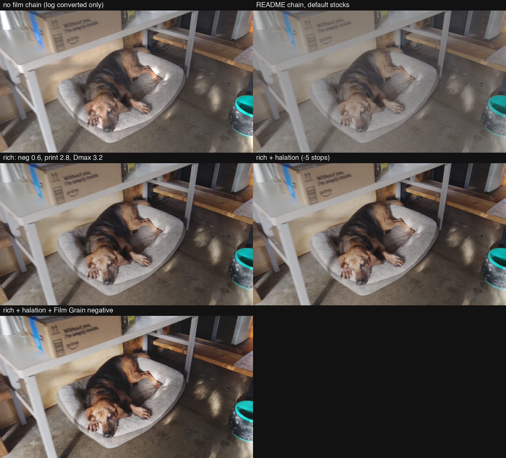

# 2026-09-12 — Film emulation from the DCTL library, not the sliders

Ryan's iPhone log clips had been through two emulations rendered by Resolve on
the Mac mini. He called the Kodak 2383 print LUT *"bland and washed out"*.
Film Look Creator clipped the darkest 1% of every clip to 0 and glowed. What he
wants: *"a richness, a deepness, a little bit of the fade."* Then, on IMG_0006:
*"No, this is not the way. There's already a full GitHub library of these."*
The library is Thatcher Freeman's utility-dctls, which Ryan had already forked.

## Tuning Film Look Creator

**Tried.** Contrast ladders, fade and richness sheets, and a print-plus-FLC
combo, all on IMG_0895.

**Happened.** Every knob moved a number. The combo pushed saturation to 154,
and no panel was the look.

**Mechanism.** Tuning has a gradient and choosing a tool does not, so the
search stayed inside the tool it started in (bible §5.10). The better tool was
in Ryan's own GitHub.

**Verdict.** Dead end, stopped at his redirect. Ledger row 26.

## The README pipeline, by script

**Tried.** The chain the utility-dctls README prescribes: Clamp 0+, Film Curve
as the negative, a printer-lights gain, Film Curve as the print. Each stage is a
DCTL tool in the clip's Fusion comp on the mini. The project is colour managed
with a Rec.709 Linear timeline, so every DCTL receives scene-linear light.
`jobs/film-look-mini/dctl_film_mini.py` builds it, with recipes kept in a JSON
file under each DCTL's own setting names.

**Happened.** Three things got in the way, and each was caught by a control:

- **The DCTL list was empty.** It is filled only when Resolve starts, and the
  DCTLs had been installed while it ran. A graceful restart fixed it. After
  that, the generic numbered slots took the DCTL's real setting names.
- **The grey frame lied.** Scripting refuses every Input Gamma value on a PNG
  still. The still's default input decodes as gamma 2.4, not the Rec.709
  camera curve the frame was encoded with. The no-chain control timeline showed
  it: every stored code came out unchanged. The frame is re-encoded, and the
  wrong one is in `jobs/film-look-mini/archive/` with the reason.
- **Speckles on the teal bowl.** Halation's red-shift matrix pushed saturated
  teal below zero, and the negative Film Curve took the log of it. There were
  872 speckle pixels, and a second Clamp 0+ took them to 0.

**Mechanism.** `film_chain.py` copies the DCTL formulas in plain Python and
solves the gain that keeps 0.18 at 0.18 before Resolve runs. With the corrected
frame, every recipe held 0.18 at display code 125. All nine grey patches came
within one code of the model. The chain in Resolve is exactly its published math.

**Verdict.** The pipeline is verified. The look is Ryan's call.

| IMG_0006 at 30 s | darkest 1% | brightest 1% | contrast | saturation |
|---|---|---|---|---|
| log converted, no chain | 37 | 211 | 44 | 15 |
| README defaults | 52 | 162 | 29 | 11 |
| rich | 24 | 188 | 47 | 18 |
| rich + Film Grain negative | 26 | 213 | 57 | 20 |

Halation at 5 stops down turned out invisible, with a mean change of 0.035
codes. The rich-plus-halation panel is the rich panel. The last panel differs
because Film Grain replaces the negative and brings its own, steeper curve.

Claims: `knowledge/utility-dctls-film-chain-in-resolve-matches-its-published-math.md`,
`knowledge/resolve-scripting-cannot-set-input-gamma-on-a-still.md`.
