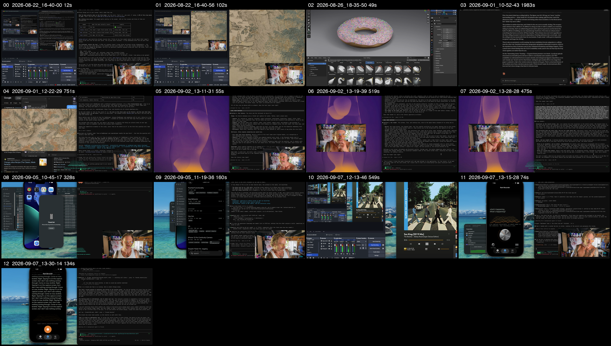
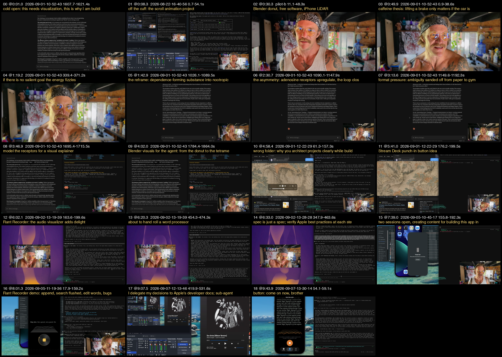

# build-in-public — one video from thirteen recordings

**What it is.** The first test of whether the studio can take a pile of
build-in-public OBS recordings and hand back one coherent video. Started
2026-09-07 from Ryan's question: *"Let's test the Media Studio's ability to
edit together a coherent single video — is that even possible?"*

**Answer, measured.** Yes at the machinery level, no at the front door, and
"coherent" is an edit decision the studio can propose but only Ryan can make.

| layer | state |
|---|---|
| Story IR, emitter, lint | already accepted many recordings on the spine; nothing needed changing |
| front door | did not exist — `ingest-recording.py` takes one file. `tools/ingest-session.py` was added |
| coherence | a proposed rough cut lives in `cuts.json`; every cut is a verdict Ryan owes |

## The material

Thirteen recordings in `/Users/SSDrive/movies`, 2026-08-22 to 2026-09-07,
all 1920×1080 at 30 fps, 87 minutes raw. One midpoint frame from each:

Silence-stripped and transcribed (Deepgram nova-3, one workspace per recording
under `outputs/projects/`), they become 39.5 minutes. Two carry no speech at
all (`05` is the audio visualiser, `11` is Rant Recorder listening) and are
B-roll. Recording `10` plays *Sun King* on screen for most of its length —
a rights problem if any of that audio reaches a published cut.

| # | recording | raw | kept | what it is |
|---|---|---|---|---|
| 00 | 2026-08-22_16-40-00 | 12s | 3s | slate: "so here I am. Cut. Cut." |
| 01 | 2026-08-22_16-40-56 | 102s | 39s | off-the-cuff intro to the scroll animation; a power-washer interruption at 0:57 |
| 02 | 2026-08-26_18-35-50 | 49s | 29s | Blender donut; "this software is free"; iPhone LiDAR for 3D people |
| 03 | 2026-09-01_10-52-43 | 33m | 19m | the caffeine research session: A2A/D2 heteromer, the Huberman rant, the reframe, "this is why I'm building the studio" |
| 04 | 2026-09-01_12-22-29 | 12.5m | 3m | wrong-folder lesson, Stream Deck punch-in idea, dictation app, App Store as a second SKU |
| 05 | 2026-09-02_13-11-31 | 55s | 1s | audio visualiser, no speech |
| 06 | 2026-09-02_13-19-39 | 8.7m | 1.6m | Rant Recorder spec: visualiser, dictionary, "hand roll a word processor" |
| 07 | 2026-09-02_13-28-28 | 7.9m | 1.7m | Write as plain text editor; verify Apple best practices |
| 08 | 2026-09-05_10-45-17 | 5.5m | 3m | continuity camera vs iPhone mirroring; two sessions open |
| 09 | 2026-09-05_11-19-36 | 2.7m | 1.2m | Rant Recorder demo: append, search "flushed", edit words, bugs |
| 10 | 2026-09-07_12-13-46 | 9.2m | 7.6m | mostly music; at 7:00 "I delegate my decisions to Apple's docs" |
| 11 | 2026-09-07_13-15-28 | 74s | 71s | Rant Recorder listening, no speech |
| 12 | 2026-09-07_13-30-14 | 134s | 5s | "Come on now, brother" into Rant Recorder |

## The proposed cut

`cuts.json` is the edit: nineteen windows in source seconds, in order, each
with a note saying why it is there. The spine of the story is *a person
building a studio so he can explain something (caffeine) that text cannot,
and the apps that fall out along the way.* Cold open on "this needs
visualization — this is why I'm building the studio", then the scroll, the
donut, the caffeine mechanism and its reframe, back to Blender, then the
apps (Rant Recorder, Write), and out on "come on now, brother".

    .venv/bin/python tools/ingest-session.py --name build-in-public-cut \
        --cuts jobs/build-in-public/cuts.json --render

Current: 19 cuts, 330 edits, 9.8 minutes, timeline
`build-in-public-cut@21504a88` (cut ends snapped to utterance ends; the
first pass clipped closing sentences), render verified for duration, size
and loudness. The whole-session concat (every recording, in date order) is
`build-in-public@e6a374f9`, 976 edits, 39.5 minutes, for scrubbing.

## Where it renders

Rendering the cut in Resolve put this MacBook (16 GB) at memory pressure, so
the render lane moved to the Mac mini the same afternoon:

    .venv/bin/python tools/render-ir.py build-in-public-cut --on mini

Resolve cannot go there (8 GB, no Resolve, 7 GB of disk; Resolve's Remote
Rendering needs Studio on both machines and a shared project library), so the
Story IR renders with ffmpeg: staged stream copies of only the windows the
cut uses, piped over ssh into ffmpeg on the mini, concatenated there, pulled
back. The three-recording proof came back frame-identical to a local ffmpeg
control (2139 frames both). The full cut: 34 runs, 147 seconds on the mini,
17578 frames exactly as the IR says, 144 MB at crf 20, verified green. One frame at each of the 19 cut points of the
Resolve render, labelled with its source and note:

## Verdicts Ryan owes

- **The Huberman rant** (03 at 4:34–5:00, 7:38–8:00, 10:31–11:26, 12:34–13:06).
  Left out of the cut; it is the most alive footage in the session and also
  the most profane. In, out, or a separate short.
- **The power-washer interruption** (01 at 0:57–1:39). Left out. Blooper or reel.
- **Recording 10's music.** The cut uses only 7:00–8:52 of it, and the cut
  point frame shows Apple Music playing *Sun Arise* on screen at that moment.
  Measured on that window: the recording's four OBS audio streams peak at
  −7.2, −7.2, −14.8 and −8.8 dB, so the music is not confined to one stream
  the timeline could drop. Either the cut loses that moment or the audio is
  replaced.
- **Order and length.** 9.8 minutes is long for a first build-in-public
  video; the caffeine block (cuts 4–11) is 5 of those minutes.

## What does not work yet

- `edit-ir find` refuses a session workspace (track 1 has many assets), so
  "insert the meme where I say X" is not available on this timeline.
  Bookmarked in `knowledge/`.
- A cut whose window falls entirely inside stripped silence fails the whole
  run (`window … keeps no frames`). The whiteboard moment at 03 1:06 did.
- Nothing reads `movies/iso/`, the camera isolates. A cut-in to the camera
  is the cheapest visual variety in this footage. Bookmarked.
