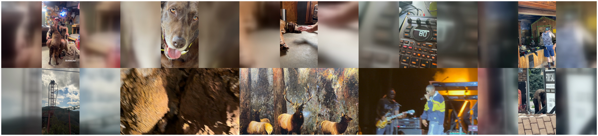

# summer-reel — ten iPhone clips, one 30-second widescreen reel

**What it is.** The first job cut after Resolve 21.1 landed (2026-09-09).
Ryan dragged ten clips out of Photos and said *"lets test it out … lets make
a fun video out of these."* Two things were under test: the studio's front
door for phone footage, and the native MCP server Blackmagic shipped in 21.1
(`docs/RESOLVE-21.1-AGENTIC.md`).

**Answer, measured.** The reel exists, compiled from a Story IR, verified by
the native server, rendered on the mini. Every cut is a verdict Ryan owes.

## The material

Ten `.mov` clips from the Photos library, 2026-08-09 to 2026-08-31, all
H.264 1280×720 at 30 fps (one at 29.97), seven shot portrait, three
landscape, six minutes raw. What arrived in the chat was ten derivative
JPEGs, and the library's `originals/` folder was empty: iCloud-optimised.
`osxphotos export --download-missing --use-photokit` pulled them in 25 s
once the terminal was granted Photos access. Route recorded in the store as
`photos-library-originals-come-down-with-osxphotos`.

## The cut

`cuts.json` is the edit: `{source, start, beats, note}` in cut order, start in
source seconds, length in beats on an 80 BPM grid (the SP-404 in clip four
reads "80", so that is the reel's tempo). At 30 fps a beat is 22.5 frames,
so beat counts are even and every cut lands on an integer frame.
`build.py` conforms each source to one 1280×720 30 fps widescreen stream
showing the whole picture: landscape sources native, portrait sources at full
height in the middle with the sides filled by a blurred stretch of the same
frame, nothing cropped, audio to −18 LUFS, then
writes `outputs/projects/summer-reel/story.json` and compiles it.

The ten in-points, in order:

| # | beats | clip | moment |
|---|---|---|---|
| 0 | 4 | garage | dog on the lap, `@casual_jazz` |
| 1 | 2 | lab | nose into the lens |
| 2 | 4 | bloodhound | the hand wave |
| 3 | 4 | SP-404 | display reads 80 |
| 4 | 4 | shooting gallery | DANGER |
| 5 | 4 | coaster | car at the top, then the drop |
| 6 | 2 | cave | ceiling (landscape, native) |
| 7 | 2 | elk painting | the bull (landscape, native) |
| 8 | 6 | concert | singer close-up (landscape, native) |
| 9 | 8 | bear | at the liquor store, the punchline |

40 beats, 900 frames, 30.00 s. Natural sound only; no music bed was added
because nothing of Ryan's own turned up on disk and a commercial track is his
call. `edit-ir.py <ws> add-music` is the verb when he names one.

## What was measured

- **Timeline** `summer-reel@6c1ef127` (current: widescreen, whole picture;
  `@471f0165` was the cropped widescreen, `@f8b0bab9` and `@058a7a33` the
  vertical versions, `@b9996010` the swapped cut, all still in the library): lint green, structure verify green, shown in Resolve at 1280×720
  30 fps.
- **Native MCP server** (`mcp-readback.py`, output in
  `evidence/mcp-readback.txt`): `run_script` read the timeline back item by
  item and matched the IR exactly (10 video items, 10 audio items, 900
  frames, 10 markers, every start and duration). Then, on a
  `DuplicateTimeline` copy named `-xfade-trial`, `AddTransition` put a
  20-frame Cross Dissolve on the cut into the bear, and
  `GetNormalizeAudioModes` listed 14 modes. The IR-compiled timeline was not
  touched; the trial copy is there for Ryan to look at and delete.
- **Render on the mini** (`render-ir.py --on mini`): ten runs encoded in
  seconds, `outputs/projects/summer-reel/render/summer-reel-mini.mp4`, 900
  frames, 1280×720, verify green.

## What went wrong

The first compile had the cave and the concert swapped: two landscape clips
were mislabeled from their filmstrips, so a 6-beat "singer" slot showed rock.
Caught by extracting the actual in-point frames, not by any check. The lesson
for the front door: a cut list should carry the in-point frame as evidence
before compile, which is what `evidence/cut-points-10.png` now is.

## Verdicts

**Given, 2026-09-09, twice.** The first version was 9:16 vertical with the
three landscape clips over a blurred fill. Ryan: *"Can you not make a full
screen video? They're all crappily cropped in."* Read as "fill the vertical
frame", it was rebuilt with a centre crop. Wrong reading. Ryan: *"That's not
full screen … video player resolution, YouTube … the one where it's long
that goes across the entire screen."* Full screen means 16:9. Rebuilt as
1280×720 widescreen with portrait clips cropped to a 16:9 window. Wrong
again. Ryan: *"widescreen. youre just cropping in the shots show the full
video. start over with the full video."* Third build: 1280×720 widescreen,
nothing cropped, portrait clips whole at full height with the sides filled
from a blur of the same frame, landscape clips native. That is the current
reel. The first reconform exposed a real defect: the IR hash did not see
media content, so the recompile reused the cached timeline over changed
files. `build.py` now writes each conformed file's sha256 into the asset,
which makes a reconform a new timeline.

**Owed:** every row in the table; whether the dissolve into the bear (on the
trial copy) is wanted, which would make transitions a Story IR field; which
track, if any, goes under it.
